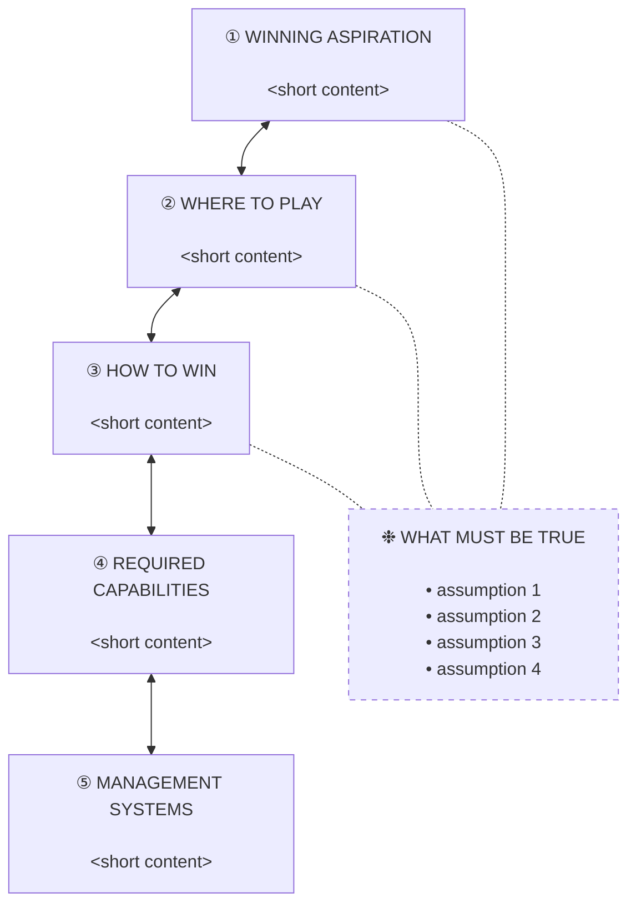

# Playing to Win Strategy Builder

## Purpose

Apply Roger Martin and A.G. Lafley's Playing to Win choice cascade directly to a business idea, offer, market move, or running product. Assume the user already knows the framework. Apply it. Do not teach it.

**Core rule:** Strategy = choices. Reject vague goals, broad markets, "AI as differentiation," or "we serve everyone." Narrowing is the point.

**Default voice:** Direct, skeptical, practical. Summary first, plain operator language, no fluff, no fake encouragement.

## When to Use

Trigger this skill when the user asks for any of:

- "Build me a Playing to Win framework around [idea/project/offer]"
- "Pressure-test this idea" / "red-team this strategy"
- "Where should we play?" / "How do we win?"
- "Should I proceed with [X]?"
- "Sharpen this positioning"
- Strategy evaluation inside an open project codebase

**Do not trigger** for general business advice, framework explanation, motivational coaching, or generic startup tips.

## Workflow

### Step 1 — Frame the Subject

Identify what is being evaluated:

- **Raw idea** — concept-only, no code, no validation
- **Existing offer** — already selling, evaluating sharpening
- **Project codebase** — running product, evaluating strategy fit
- **Market move** — repositioning, expansion, new wedge

If a project codebase is open, run Step 2a and 2b. Otherwise skip to Step 3.

### Step 2a — Project Codebase Discovery

When invoked inside a project, gather strategic signal from the code itself:

- Read `README.md`, `package.json` / `pyproject.toml` / `Cargo.toml` / `go.mod`, top-level docs
- Skim `app/` or `src/` route or page tree to understand surface area
- Check `marketing/`, `landing/`, `copy/`, hero copy, HTML `<title>` and meta tags for current positioning
- Look at `pricing/`, billing config, Stripe products, or paywall code for current monetization
- Check `analytics`, `events`, telemetry, or feature-flag modules for what is measured
- Treat tech stack as a capability signal only, not as the strategy

Capture: current customer (inferred), current positioning (verbatim quotes from copy), current offer and pricing, current capabilities visible in code, current measurement.

### Step 2b — External and Internal Research

- **Market research:** Use available web-research tools (Firecrawl, Exa, WebSearch) to find competitors, pricing, category language, and recent shifts. Cite sources. Label FACTS vs INFERENCES vs ASSUMPTIONS.
- **Internal capabilities:** From the codebase and user input, list capabilities that are real today versus aspirational.
- **Decision-making criteria:** Surface what would change the recommendation (urgency, willingness to pay, reachable channel, defensibility).

### Step 3 — Apply the Cascade

Produce the 12-section Standard Output (see below). Use the quality rubric in `references/strategy_quality_rubric.md` as the bar. Pull from the example bank, assumption tests, and positioning patterns to sharpen each section.

Load reference files on demand:

- Verdict ambiguity → `references/strategy_quality_rubric.md`
- Sharpening a vague idea → `references/strategy_example_bank.md` and `references/positioning_patterns.md`
- Section 8 (What Must Be True) → `references/assumption_test_bank.md`
- Tone, output style, decision lens → `references/strategy_preferences.md`

### Step 4 — Add Execution Lens If Relevant

If the strategy involves team execution, rollout, sales motion, organizational adoption, or operating cadence, add a short Execution Lens drawing from `references/execution_patterns.md`:

- Pre-build privately, facilitate publicly
- Loose guardrails, push ownership down the layers
- Critical Few, not the trivial many
- War game before launch
- Communication Matrix
- Leading indicators, not just lagging outcomes
- Initiative tracking with hypothesis → result → lesson

Skip the Execution Lens for solo consumer products, content experiments, or single-person side projects.

### Step 5 — Quality Gate Before Returning

Internally confirm:

- Real choices made, not descriptions
- Where to Play **and** Where Not to Play both defined
- How to Win is specific (not "better service" or "AI")
- Alternatives named
- FACTS separated from ASSUMPTIONS
- Biggest risk named
- Practical 30-day test included
- Final recommendation: Proceed / Narrow / Test manually / Park / Kill
- Both strategy file paths reported: `.html` (primary) and `.md` (see Step 6)

If any gate fails, fix it before returning.

### Step 6 — Write the Strategy Files (Markdown + HTML)

After the analysis is complete, write the full output to BOTH a persistent markdown file and a self-contained interactive HTML page. Do not dump all 12 sections into the terminal; the terminal gets a short briefing instead (see the Standard Output section below).

First write the markdown file:

- Default path: `./strategy/playing-to-win-{slug}-{YYYY-MM-DD}.md`
- Slug is a lowercase, hyphenated version of the subject (e.g. `northwind-books`, `atlas-payroll-clinics`)
- Date is the current date in ISO format
- Create the `./strategy/` directory if it does not exist
- Include YAML frontmatter at the top of the generated file:

```yaml
---
subject: <one-line subject>
verdict: <Proceed | Narrow | Test manually | Park | Kill>
confidence: <Low | Medium | High>
date: <YYYY-MM-DD>
generated_by: playing-to-win v1.1
---
```

Then write the full editorial output below the frontmatter.

#### HTML page

Also write a self-contained interactive HTML page next to the markdown file:

- Path: `./strategy/playing-to-win-{slug}-{date}.html` (same slug and date as the markdown).
- Read `references/strategy-template.html`. Replace the tokens `{{SUBJECT}}`, `{{VERDICT}}`, `{{CONFIDENCE}}`, `{{DATE}}`, `{{YEAR}}`, then replace the `<!-- P2W:BODY -->` marker with the 13 sections rendered as semantic HTML.
- Follow `references/html_render_contract.md` exactly for the component structure (load it now). The template's CSS and JS depend on those classes and data attributes.
- Generate all 13 sections in order: snapshot (with the 5-node cascade and "where not to play"), executive-verdict, the five cascade sections, what-must-be-true (assumptions cross-linked to cascade nodes via `data-relates`), premortem, sharpened, validation-plan, summary, recommendation (verdict plate).
- Write the result as one file. It must be fully self-contained: no external fonts, scripts, or styles.
- After writing, open it in the default browser (best effort): run `open "<path>"` on macOS, `xdg-open "<path>"` on Linux, or `start "" "<path>"` on Windows. If opening fails or the environment is headless, just report the path.

See `examples/example-output.html` for a complete rendered reference.

Report the absolute paths of BOTH written files (`.html` first, then `.md`) at the end of the response.

If the working directory is read-only or the user has specified a different location, ask once before writing.

## Standard Output (Editorial Format)

**Terminal vs. files.** The full 12-section editorial format below is the content of the **markdown file** (the HTML page renders the same content as 13 sections — the closing recommendation banner becomes its own section). In the terminal (chat) do NOT print all 12 sections. Print a short briefing only: the verdict and confidence; the strongest part, weakest part, biggest risk, and fastest improvement; the single first move from the 30-day plan; and the two file paths (`.html` and `.md`). The HTML page is the primary deliverable to read.

Render the 12 sections in this exact order, grouped into four phases. Use Unicode box characters (━ ┏ ┓ ┃ ┗ ┛ ╔ ╗ ╚ ╝ ║ ═) for the editorial callouts shown below. Plain Unicode only — no ANSI color codes.

### Visual Conventions

Apply these formatting rules consistently throughout the output.

**Phase headers.** Render each phase boundary as a heavy editorial rule with the phase label and a one-line framer. 78 characters wide for standard 80-column terminals.

```
━━━━━━━━━━━━━━━━━━━━━━━━━━━━━━━━━━━━━━━━━━━━━━━━━━━━━━━━━━━━━━━━━━━━━━━━━━━━━━
  PHASE I  ·  DIAGNOSIS
  Frame the subject. Snapshot the choices. Render the verdict.
━━━━━━━━━━━━━━━━━━━━━━━━━━━━━━━━━━━━━━━━━━━━━━━━━━━━━━━━━━━━━━━━━━━━━━━━━━━━━━
```

Locked framer text per phase:

- **Phase I — Diagnosis:** *Frame the subject. Snapshot the choices. Render the verdict.*
- **Phase II — The Cascade:** *The five interlocking choices. Each constrains the others.*
- **Phase III — Stress Test:** *Assumptions named. Failure modes mapped. Countermeasures committed.*
- **Phase IV — Verdict:** *Sharpened, validated, and ready to test, ship, or kill.*

**Tables.** Render tables flush-left in standard Markdown format. Do NOT indent tables — leading whitespace breaks GitHub Markdown rendering. Above each table, include a **bold kicker label** that provides context. One blank line above and below each table.

```
**Choices and recommendations**

| Choice | Recommendation |
|---|---|
| Primary customer | ... |
```

**Bullets.** Use two glyphs with specific purposes:

- **`•`** — regular content bullets inside editorial callouts (code-block contexts)
- **`▸`** — highlight or conclusion pointers (the single sentence that closes a section: *"We win by..."*, *"Biggest capability gap:"*, *"Kill or reposition if..."*)

In standard Markdown list contexts (outside code blocks), use `-` as the bullet character. Markdown renderers display it as `•`.

**Final recommendation banner.** Render the closing verdict with a double-line border for visual climax. 78 chars wide to match phase headers.

```
╔══════════════════════════════════════════════════════════════════════════════╗
║                            RECOMMENDATION                                    ║
╠══════════════════════════════════════════════════════════════════════════════╣
║                                                                              ║
║                            ▸  <VERDICT>                                      ║
║                                                                              ║
║  <One-sentence rationale, wrapped at ~70 chars width.>                       ║
║                                                                              ║
║  Strategy page: ./strategy/playing-to-win-{slug}-{date}.html                 ║
║                                                                              ║
╚══════════════════════════════════════════════════════════════════════════════╝
```

### Phase I — Diagnosis

#### 1. P2W Snapshot (Waterfall)

Render the snapshot as a top-down cascade waterfall. Each cascade question gets its own outlined box. Bi-directional connectors (▲│▼) between every adjacent pair signal that the cascade is iterative, not one-way. "What Must Be True" sits as a parallel column on the right, anchored to the same vertical position as Where to Play.

**Box specifications:**

- Inner content width: 32 characters
- Outer box width: 34 characters (32 + 2 borders)
- Indent step between cascade levels: 3 spaces
- Wrap content at word boundaries, never mid-word
- Use plain Unicode box-drawing characters: `┌ ┐ └ ┘ ─ │ ├ ┤ ▲ ▼`
- Use circled numerals for the cascade: `① ② ③ ④ ⑤`
- Use `❉` for the What Must Be True sidebar marker

**Template:**

```
┌──────────────────────────────────┐
│ ① WINNING ASPIRATION             │
├──────────────────────────────────┤
│ <wrapped content, 32 chars max>  │
│ <continued lines as needed>      │
└──────────────────────────────────┘
               ▲
               │
               ▼
   ┌──────────────────────────────────┐
   │ ② WHERE TO PLAY                  │       ┌──────────────────────────────┐
   ├──────────────────────────────────┤       │ ❉ WHAT MUST BE TRUE          │
   │ <wrapped content>                │       ├──────────────────────────────┤
   │                                  │       │ • <assumption 1>             │
   └──────────────────────────────────┘       │ • <assumption 2>             │
                  ▲                           │ • <assumption 3>             │
                  │                           │ • <assumption 4>             │
                  ▼                           │ • <assumption 5>             │
      ┌──────────────────────────────────┐    └──────────────────────────────┘
      │ ③ HOW TO WIN                     │
      ├──────────────────────────────────┤
      │ <wrapped content>                │
      └──────────────────────────────────┘
                     ▲
                     │
                     ▼
         ┌──────────────────────────────────┐
         │ ④ REQUIRED CAPABILITIES          │
         ├──────────────────────────────────┤
         │ <wrapped content>                │
         └──────────────────────────────────┘
                        ▲
                        │
                        ▼
            ┌──────────────────────────────────┐
            │ ⑤ MANAGEMENT SYSTEMS             │
            ├──────────────────────────────────┤
            │ <wrapped content>                │
            └──────────────────────────────────┘
```

**Then immediately below the ASCII waterfall, include a Mermaid block** for surfaces that render it (GitHub, Obsidian, VS Code preview, modern Markdown viewers):

````markdown

````

**Below both diagrams, add a brief "Where Not to Play" bullet block** (not in the waterfall — those choices are absences, not nodes):

```
WHERE NOT TO PLAY
─────────────────
• <customer / channel / offer to avoid>
• <customer / channel / offer to avoid>
• <customer / channel / offer to avoid>
```

#### 2. Executive Verdict

Render as a callout:

```
━━━━━━━━━━━━━━━━━━━━━━━━━━━━━━━━━━━━━━━━━━━━━━━━━━━━━━━━━━━━
  EXECUTIVE VERDICT
━━━━━━━━━━━━━━━━━━━━━━━━━━━━━━━━━━━━━━━━━━━━━━━━━━━━━━━━━━━━

  <One of: Strong strategic candidate · Promising but unfocused ·
  Useful niche, not a full business yet · Weak as currently framed ·
  Bad idea unless materially changed>

  • Strongest part: ...
  • Weakest part: ...
  • Biggest risk: ...
  • Fastest improvement: ...
```

### Phase II — The Cascade

Render sections 3 through 7 as numbered editorial callouts using the format below. Each cascade question is its own visual unit.

#### 3. Winning Aspiration

```
━━━━━━━━━━━━━━━━━━━━━━━━━━━━━━━━━━━━━━━━━━━━━━━━━━━━━━━━━━━━
  ①  WINNING ASPIRATION
━━━━━━━━━━━━━━━━━━━━━━━━━━━━━━━━━━━━━━━━━━━━━━━━━━━━━━━━━━━━

  Become the default <category> for <specific customer> who need
  <specific outcome> without <specific pain>.

  Reject: "be the best", "help everyone", "trusted brand",
  "transform the market".
```

#### 4. Where to Play

```
━━━━━━━━━━━━━━━━━━━━━━━━━━━━━━━━━━━━━━━━━━━━━━━━━━━━━━━━━━━━
  ②  WHERE TO PLAY
━━━━━━━━━━━━━━━━━━━━━━━━━━━━━━━━━━━━━━━━━━━━━━━━━━━━━━━━━━━━
```

Then the choices table:

| Choice | Recommendation |
|---|---|
| Primary customer | |
| End user | |
| Use case | |
| Market / category | |
| Channel | |
| Price tier | |
| Timing trigger | |

Then **Where Not to Play**: customers, channels, offers, price points to avoid. Be blunt.

#### 5. How to Win

```
━━━━━━━━━━━━━━━━━━━━━━━━━━━━━━━━━━━━━━━━━━━━━━━━━━━━━━━━━━━━
  ③  HOW TO WIN
━━━━━━━━━━━━━━━━━━━━━━━━━━━━━━━━━━━━━━━━━━━━━━━━━━━━━━━━━━━━
```

Why the chosen customer picks this over alternatives.

| Alternative | Why used now | Weakness | How we beat it |
|---|---|---|---|

Close with a single-sentence callout:

```
  ▸ We win by <specific advantage> for <specific customer>
    because <reason they care>.
```

If the closing line is generic, call it out and rewrite.

#### 6. Required Capabilities

```
━━━━━━━━━━━━━━━━━━━━━━━━━━━━━━━━━━━━━━━━━━━━━━━━━━━━━━━━━━━━
  ④  REQUIRED CAPABILITIES
━━━━━━━━━━━━━━━━━━━━━━━━━━━━━━━━━━━━━━━━━━━━━━━━━━━━━━━━━━━━
```

| Capability | Why it matters | Build / Buy / Partner / Avoid |
|---|---|---|

Close with a callout:

```
  ▸ Biggest capability gap: <named gap>
```

#### 7. Management Systems

```
━━━━━━━━━━━━━━━━━━━━━━━━━━━━━━━━━━━━━━━━━━━━━━━━━━━━━━━━━━━━
  ⑤  MANAGEMENT SYSTEMS
━━━━━━━━━━━━━━━━━━━━━━━━━━━━━━━━━━━━━━━━━━━━━━━━━━━━━━━━━━━━
```

| System | Track or do | Why it matters |
|---|---|---|

Always include a kill or reposition rule as a callout:

```
  ▸ Kill or reposition if <specific numeric trigger>.
    Example: 20 qualified prospects understand the offer but
    fewer than 2 are willing to pay.
```

### Phase III — Stress Test

#### 8. What Must Be True

| Assumption | Confidence (High / Medium / Low / Unknown) | How to test |
|---|---|---|

Prioritize: urgency, willingness to pay, buyer understanding, reachable channel, differentiation, fulfillment repeatability, trust, timing trigger.

#### 9. Red-Team Pre-Mortem

Assume failure 12 months from now. List likely reasons, then top 3 risks with countermeasures.

Common failure modes: buyer didn't care enough; problem real but not urgent; offer hard to explain; sales cycle too long; advantage easy to copy; founder-hero fulfillment; liked but wouldn't pay.

### Phase IV — Verdict

#### 10. Sharpened Strategic Version

If too broad, rewrite:

- Original idea
- Sharper version (one sentence)
- Why better
- Who it is for
- What it refuses to do
- First offer to test

#### 11. 30-Day Validation Plan

- Week 1: Clarify offer, ICP, proof asset, outreach list
- Week 2: Outreach, buyer conversations, objection capture
- Week 3: Paid or manual test, refine positioning, capture prospect language
- Week 4: Decide proceed / narrow / pivot / kill, define next test

Specific actions, not generic milestones.

#### 12. Presentation-Ready Summary

- Strategy in one sentence
- Who it is for
- Why they care
- How we win
- What we will not do
- First proof point to validate

Close the entire output with the double-line recommendation banner specified in Visual Conventions:

```
╔══════════════════════════════════════════════════════════════════════════════╗
║                            RECOMMENDATION                                    ║
╠══════════════════════════════════════════════════════════════════════════════╣
║                                                                              ║
║                            ▸  <VERDICT>                                      ║
║                                                                              ║
║  <One-sentence rationale tied to the strongest fact or assumption.>          ║
║                                                                              ║
║  Strategy page: ./strategy/playing-to-win-<slug>-<date>.html                 ║
║                                                                              ║
╚══════════════════════════════════════════════════════════════════════════════╝
```

Verdict must be one of: PROCEED · NARROW · TEST MANUALLY · PARK · KILL.

## Evidence Rules

Label every non-trivial claim:

- **[FACT]** — known or source-supported
- **[INFERENCE]** — reasonable conclusion from available data
- **[ASSUMPTION]** — needed but unproven
- **[SPECULATION]** — possible but uncertain

When browsing tools are available and the answer depends on current market info, competitor pricing, regulatory details, platform behavior, or recent trends, browse and cite. Do not fake certainty.

## Clarifying Questions

Do not slow the user down. If the request is understandable, proceed using labeled assumptions. Ask only if missing information materially changes the strategy. Maximum 3 questions.

## Tone Calibration

- Weak idea: *"Useful idea, weak strategy as currently framed."*
- Too broad market: *"This is not narrow enough to win yet."*
- Generic advantage: *"That is not a real advantage yet."*
- Promising but scattered: *"The raw material is good. The strategy needs a sharper wedge."*

Never inflate weak ideas. Never use motivational filler.

## Document Formats

The generated strategy file is canonical Markdown. To convert it to other formats, use pandoc (install once via `brew install pandoc` on macOS or `apt install pandoc` on Linux):

```bash
# Convert to Word
pandoc ./strategy/playing-to-win-<slug>-<date>.md -o strategy.docx

# Convert to PDF (requires LaTeX or wkhtmltopdf)
pandoc ./strategy/playing-to-win-<slug>-<date>.md -o strategy.pdf

# Convert to HTML
pandoc ./strategy/playing-to-win-<slug>-<date>.md -o strategy.html --standalone
```

If the user explicitly requests a Word or PDF deliverable, run the appropriate pandoc command after writing the markdown file. If pandoc is not installed, instruct the user to install it and supply the one-liner above.

## References

Load on demand. Do not auto-load all of these every conversation.

- `references/strategy_quality_rubric.md` — verdict criteria, quality gates, red flags
- `references/strategy_example_bank.md` — calibration examples for weak, strong, and sharpened strategies
- `references/assumption_test_bank.md` — practical tests by assumption type
- `references/positioning_patterns.md` — strong and weak positioning, wedge patterns, where-not-to-play
- `references/strategy_preferences.md` — output style, decision lenses, tone calibration
- `references/execution_patterns.md` — execution lens patterns for rollout, adoption, and operating cadence
- `references/html_render_contract.md` — component vocabulary for rendering the HTML page (load at write time, Step 6)
- `references/strategy-template.html` — locked self-contained HTML shell injected at write time (asset, not prose)

## Common Mistakes

| Mistake | Fix |
|---|---|
| Treating a feature as a strategy | Force a Where to Play table |
| "AI" as the differentiation | Demand a specific buyer-visible advantage |
| "Small businesses" as a market | Demand revenue band, role, trigger event |
| Plan with no kill criteria | Add a numeric kill or reposition rule |
| Validation that does not involve real buyers | Replace with paid manual test or signed pilot |
| Praise without verdict | Force Proceed / Narrow / Test / Park / Kill |
| Skipping Where Not to Play | Refuse to ship the answer until both halves exist |
| Forgetting to write the strategy file | Step 6 is mandatory unless the user opts out |

## Attribution

Playing to Win is the strategy framework developed by Roger L. Martin and A.G. Lafley, documented in *Playing to Win: How Strategy Really Works* (Harvard Business Review Press, 2013). This skill applies their cascade. It does not replace the book. Read the original for the underlying theory. See `THIRD_PARTY_NOTICES.md` for full attribution.
