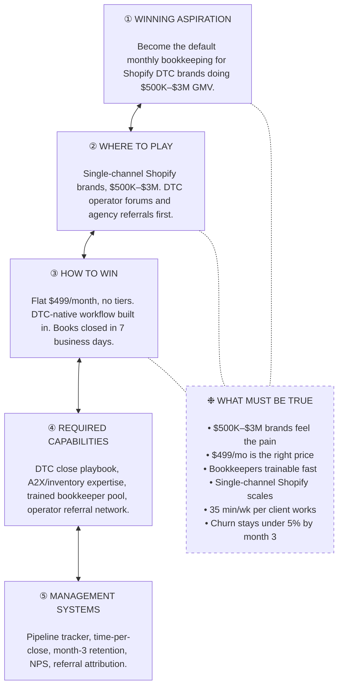

# Playing to Win — Northwind Books

> **Note:** This is a sample output showing the editorial format produced by
> the skill. Northwind Books is a fictional company used to demonstrate the
> cascade. Numbers are illustrative.

```
━━━━━━━━━━━━━━━━━━━━━━━━━━━━━━━━━━━━━━━━━━━━━━━━━━━━━━━━━━━━━━━━━━━━━━━━━━━━━━
  PHASE I  ·  DIAGNOSIS
  Frame the subject. Snapshot the choices. Render the verdict.
━━━━━━━━━━━━━━━━━━━━━━━━━━━━━━━━━━━━━━━━━━━━━━━━━━━━━━━━━━━━━━━━━━━━━━━━━━━━━━
```

### 1. P2W Snapshot (Waterfall)

```
┌──────────────────────────────────┐
│ ① WINNING ASPIRATION             │
├──────────────────────────────────┤
│ Become the default monthly       │
│ bookkeeping service for Shopify  │
│ DTC brands doing $500K–$3M GMV.  │
└──────────────────────────────────┘
               ▲
               │
               ▼
   ┌──────────────────────────────────┐
   │ ② WHERE TO PLAY                  │       ┌──────────────────────────────┐
   ├──────────────────────────────────┤       │ ❉ WHAT MUST BE TRUE          │
   │ Single-channel Shopify brands,   │       ├──────────────────────────────┤
   │ $500K–$3M. DTC operator forums   │       │ • $500K–$3M brands feel pain │
   │ and agency referrals first.      │       │ • $499/mo is the right price │
   └──────────────────────────────────┘       │ • Bookkeepers trainable fast │
                  ▲                           │ • Shopify-only scales clean  │
                  │                           │ • 35 min/wk per client works │
                  ▼                           │ • Churn stays under 5% by m3 │
      ┌──────────────────────────────────┐    └──────────────────────────────┘
      │ ③ HOW TO WIN                     │
      ├──────────────────────────────────┤
      │ Flat $499/month, no tiers.       │
      │ DTC-native workflow (Shopify,    │
      │ A2X, inventory) built in, not    │
      │ bolted on. Books closed in 7     │
      │ business days.                   │
      └──────────────────────────────────┘
                     ▲
                     │
                     ▼
         ┌──────────────────────────────────┐
         │ ④ REQUIRED CAPABILITIES          │
         ├──────────────────────────────────┤
         │ DTC close playbook, A2X/         │
         │ inventory expertise, trained     │
         │ bookkeeper pool, DTC operator    │
         │ referral network.                │
         └──────────────────────────────────┘
                        ▲
                        │
                        ▼
            ┌──────────────────────────────────┐
            │ ⑤ MANAGEMENT SYSTEMS             │
            ├──────────────────────────────────┤
            │ Pipeline tracker, time-per-      │
            │ close, month-3 retention, NPS,   │
            │ referral attribution.            │
            └──────────────────────────────────┘
```



**Where not to play**

- Multi-channel brands (Shopify + Amazon + retail)
- Service-based small businesses
- Brands under $500K GMV (price-sensitive, pain not acute)
- PE-backed or $10M+ brands (need fractional CFO, not bookkeeping)

### 2. Executive Verdict

```
━━━━━━━━━━━━━━━━━━━━━━━━━━━━━━━━━━━━━━━━━━━━━━━━━━━━━━━━━━━━
  EXECUTIVE VERDICT
━━━━━━━━━━━━━━━━━━━━━━━━━━━━━━━━━━━━━━━━━━━━━━━━━━━━━━━━━━━━

  Promising but unfocused.

  • Strongest part: The recent collapse of a major SMB
    bookkeeping provider left thousands of DTC brands actively
    shopping for a replacement. The buying window is open now.
    [INFERENCE]
  • Weakest part: "DTC" is still too broad. Multi-channel
    brands (Shopify + Amazon + wholesale) have radically
    different accounting complexity. Pricing breaks.
  • Biggest risk: Founder hits the hiring wall at 15 clients.
    Trained DTC bookkeepers are scarce. Growth stalls before
    the unit economics validate. [ASSUMPTION]
  • Fastest improvement: Cut to single-channel Shopify only,
    $500K–$3M GMV. Defer multi-channel until the close
    playbook is proven and the hiring pipeline is real.
    [ASSUMPTION]
```

```
━━━━━━━━━━━━━━━━━━━━━━━━━━━━━━━━━━━━━━━━━━━━━━━━━━━━━━━━━━━━━━━━━━━━━━━━━━━━━━
  PHASE II  ·  THE CASCADE
  The five interlocking choices. Each constrains the others.
━━━━━━━━━━━━━━━━━━━━━━━━━━━━━━━━━━━━━━━━━━━━━━━━━━━━━━━━━━━━━━━━━━━━━━━━━━━━━━
```

```
━━━━━━━━━━━━━━━━━━━━━━━━━━━━━━━━━━━━━━━━━━━━━━━━━━━━━━━━━━━━
  ①  WINNING ASPIRATION
━━━━━━━━━━━━━━━━━━━━━━━━━━━━━━━━━━━━━━━━━━━━━━━━━━━━━━━━━━━━

  Become the default monthly bookkeeping service for
  single-channel Shopify DTC brands ($500K–$3M GMV) who are
  too big for a spreadsheet and too small for a CFO.

  Reject: "best in class", "modern bookkeeping for growing
  businesses", "AI-powered finance for every founder".
```

```
━━━━━━━━━━━━━━━━━━━━━━━━━━━━━━━━━━━━━━━━━━━━━━━━━━━━━━━━━━━━
  ②  WHERE TO PLAY
━━━━━━━━━━━━━━━━━━━━━━━━━━━━━━━━━━━━━━━━━━━━━━━━━━━━━━━━━━━━
```

**Choices and recommendations**

| Choice | Recommendation |
|---|---|
| Primary customer | Shopify DTC founder, $500K–$3M GMV, no in-house finance hire |
| End user | Same as primary (founder owns the books today) |
| Use case | Monthly close, inventory accounting, sales-tax reconciliation, tax-ready books |
| Market / category | "DTC bookkeeping" — adjacent to general SMB bookkeeping, narrower |
| Channel | DTC operator Slack communities and newsletters; agency partner referrals after 10 case studies |
| Price tier | Flat $499/month, no tiers, no hourly bolt-ons, no setup fee |
| Timing trigger | Provider failure or churn, tax season, first audit notice, $1M revenue milestone, fundraise prep |

**Where not to play**

- Multi-channel brands (Amazon + Shopify + retail) — accounting complexity breaks flat pricing
- Service-based small businesses (no inventory, wrong workflow)
- Brands under $500K GMV (price-sensitive, founder still doing it themselves)
- PE-backed or $10M+ brands (need fractional CFO, not bookkeeping)
- Selling through the Shopify App Store directly (noisy channel, wrong intent)

```
━━━━━━━━━━━━━━━━━━━━━━━━━━━━━━━━━━━━━━━━━━━━━━━━━━━━━━━━━━━━
  ③  HOW TO WIN
━━━━━━━━━━━━━━━━━━━━━━━━━━━━━━━━━━━━━━━━━━━━━━━━━━━━━━━━━━━━
```

**Why this customer picks us over alternatives**

| Alternative | Why used now | Weakness | How we beat it |
|---|---|---|---|
| Founder does it in QBO | Free, "I'll get to it" | 8+ hours/month, mistakes at tax time | We give back the time and the accuracy |
| Generic SMB bookkeeper | Cheap, local | Doesn't know Shopify, A2X, or inventory accounting; asks the founder questions | We come pre-trained on the DTC stack |
| Pilot / Bench-tier service | Brand recognition | Generic workflow, slow inventory close, tiered pricing | DTC-native workflow, flat price, 7-day close |
| Hire in-house bookkeeper | Dedicated attention | $60K+/year fully loaded for one person | $6K/year fully outsourced with redundancy |

  ▸ We win by being the only bookkeeping team that already
    knows how Shopify, A2X, and inventory accounting fit
    together, because we built the practice around DTC instead
    of bolting DTC onto a general firm.

```
━━━━━━━━━━━━━━━━━━━━━━━━━━━━━━━━━━━━━━━━━━━━━━━━━━━━━━━━━━━━
  ④  REQUIRED CAPABILITIES
━━━━━━━━━━━━━━━━━━━━━━━━━━━━━━━━━━━━━━━━━━━━━━━━━━━━━━━━━━━━
```

**Build / Buy / Partner / Avoid**

| Capability | Why it matters | Decision |
|---|---|---|
| DTC monthly close playbook | Repeatable workflow per client | Build — founder's IP |
| A2X + inventory accounting expertise | The hard part competitors fumble | Build — founder's IP |
| Trained bookkeeper pool | The only way past 15 clients | Build (hiring + training pipeline) |
| Client portal and document intake | Reduces back-and-forth, lowers minutes/client | Buy (existing SaaS) |
| DTC operator referral network | Distribution past the first 20 | Partner |
| Sales-tax software (TaxJar, etc.) | Compliance scales, we don't reinvent | Buy |

  ▸ Biggest capability gap: Hiring and training bookkeepers who
    can run a DTC close without founder hand-holding. The
    founder is the bottleneck at 15 clients. Build the hiring
    pipeline before the marketing pipeline.

```
━━━━━━━━━━━━━━━━━━━━━━━━━━━━━━━━━━━━━━━━━━━━━━━━━━━━━━━━━━━━
  ⑤  MANAGEMENT SYSTEMS
━━━━━━━━━━━━━━━━━━━━━━━━━━━━━━━━━━━━━━━━━━━━━━━━━━━━━━━━━━━━
```

**Operating systems and tracking**

| System | Track or do | Why it matters |
|---|---|---|
| Pipeline tracker | Conversations, trials started, paid conversions | Catches stalls early |
| Time-per-close per bookkeeper | Minutes per client per month | Margin lives or dies here |
| Month-3 retention dashboard | % of clients still active at day 90 | The real churn signal, not month 1 |
| NPS after first close | 0–10 + reason | Predicts referrals and churn |
| Referral attribution | Which community or partner sent the lead | Find the 3 channels that matter |

  ▸ Kill or reposition rule: If 30 qualified Shopify brands in
    the $500K–$3M range hear the offer, 10+ start a trial, and
    fewer than 3 stay past month 3, the pricing is wrong or the
    workflow does not actually save the founder time. Cut to
    $299/month or reposition as a year-end catch-up service.

```
━━━━━━━━━━━━━━━━━━━━━━━━━━━━━━━━━━━━━━━━━━━━━━━━━━━━━━━━━━━━━━━━━━━━━━━━━━━━━━
  PHASE III  ·  STRESS TEST
  Assumptions named. Failure modes mapped. Countermeasures committed.
━━━━━━━━━━━━━━━━━━━━━━━━━━━━━━━━━━━━━━━━━━━━━━━━━━━━━━━━━━━━━━━━━━━━━━━━━━━━━━
```

### 8. What Must Be True

**Critical assumptions and confidence**

| Assumption | Confidence | How to test |
|---|---|---|
| $500K–$3M Shopify brands feel monthly bookkeeping pain | Medium | Survey 30 brands in DTC Slack communities; ask what they do today and where it breaks |
| Founders will pay $499/month flat | Low | Show pricing to 10 prospects with a real offer, measure trial signups |
| Trained DTC bookkeepers can be hired in under 60 days | Low [ASSUMPTION] | Post one job, measure qualified applicants per week |
| Single-channel Shopify positioning beats generic bookkeeping for SEO and referrals | Medium | A/B test landing page copy; track time-on-page and conversion |
| Margin works at 35 minutes/week per client | Medium | Time-track 3 pilot closes; back into hourly margin at $499 |
| Month-3 retention stays above 95% | Unknown | Run pilots for 90+ days before scaling |

### 9. Red-Team Pre-Mortem

Assume failure 12 months from now. Likely reasons:

1. **Founder became the bottleneck.** Could not hire trained DTC bookkeepers fast enough. Capped at 20 clients. Growth stalled while overhead climbed.
2. **Brands churned at month 6.** Got caught up on back-bookkeeping, then left. Did not see ongoing value once the books were clean.
3. **Larger competitors added DTC verticals.** Pilot or a new entrant launched a DTC tier. The positioning edge eroded inside 18 months.

**Top 3 risks with countermeasures**

| Risk | Countermeasure |
|---|---|
| Hiring bottleneck at 15 clients | Build the hiring pipeline before the marketing pipeline. Hire and train bookkeeper #2 before client #10. |
| Month-6 churn after catch-up | Bundle quarterly tax-prep and inventory-valuation reviews. Make the ongoing work visible. |
| Competitor adds DTC tier | Lock in operator-network exclusivity. Sign 5 agency partners as referral channels in the first 90 days. |

```
━━━━━━━━━━━━━━━━━━━━━━━━━━━━━━━━━━━━━━━━━━━━━━━━━━━━━━━━━━━━━━━━━━━━━━━━━━━━━━
  PHASE IV  ·  VERDICT
  Sharpened, validated, and ready to test, ship, or kill.
━━━━━━━━━━━━━━━━━━━━━━━━━━━━━━━━━━━━━━━━━━━━━━━━━━━━━━━━━━━━━━━━━━━━━━━━━━━━━━
```

### 10. Sharpened Strategic Version

- **Original idea:** "Bookkeeping for DTC brands."
- **Sharper version:** "Flat-fee monthly bookkeeping for single-channel Shopify DTC brands doing $500K–$3M GMV. $499/month. Books closed in 7 business days."
- **Why better:** Specific platform (Shopify), specific scale ($500K–$3M), specific channel posture (single-channel only), specific delivery promise (7-day close). Each constraint excludes a long list of bad-fit prospects.
- **Who it is for:** Shopify DTC founders running one storefront, $500K–$3M GMV, no in-house finance person.
- **What it refuses to do:** Multi-channel brands, service businesses, sub-$500K shops, $10M+ brands, tiered pricing, hourly bolt-ons.
- **First offer to test:** 3 pilot brands at $499/month for 90 days. Founder-led close on all 3. Goal: month-3 retention on 2 of 3.

### 11. 30-Day Validation Plan

- **Week 1:** Build ICP list of 30 single-channel Shopify brands in the $500K–$3M band. Ship a one-page landing page with the offer. Write the founder-led outreach script.
- **Week 2:** Run 30 outbound conversations through DTC Slack communities and warm intros. Capture top 5 objections verbatim. Target 5 trial requests.
- **Week 3:** Onboard 3 pilots. Run the first close. Time-track every minute. Document where the workflow breaks.
- **Week 4:** Decision. 3 brands committed to month 2 at $499 = Proceed to next 10. 0–1 committed = pricing is wrong; test $299/month or reposition as catch-up only.

### 12. Presentation-Ready Summary

- **Strategy in one sentence:** Be the default monthly bookkeeping for single-channel Shopify DTC brands ($500K–$3M GMV), priced flat at $499/month with a 7-day close.
- **Who it is for:** Shopify DTC founders running one storefront, no in-house finance person.
- **Why they care:** They are losing 8 hours a month to QBO, making tax-time mistakes, and the obvious alternatives either do not know Shopify or charge $60K+ a year.
- **How we win:** DTC-native workflow (Shopify, A2X, inventory) built in from day one, flat pricing, fast close.
- **What we will not do:** Multi-channel, services, sub-$500K, $10M+, tiered pricing.
- **First proof point:** 2 of 3 pilot brands still paying at month 3.

```
╔══════════════════════════════════════════════════════════════════════════════╗
║                            RECOMMENDATION                                    ║
╠══════════════════════════════════════════════════════════════════════════════╣
║                                                                              ║
║                            ▸  NARROW                                         ║
║                                                                              ║
║  The buying window is open (a major SMB bookkeeping provider recently        ║
║  collapsed) and the DTC-native workflow is a real wedge, but "DTC" is        ║
║  still too broad. Cut to single-channel Shopify brands at $500K–$3M GMV,     ║
║  prove the close playbook on 3 pilots, build the bookkeeper hiring           ║
║  pipeline before the marketing pipeline, then expand.                        ║
║                                                                              ║
║  Strategy file: ./strategy/playing-to-win-northwind-books-2026-05-14.md      ║
║                                                                              ║
╚══════════════════════════════════════════════════════════════════════════════╝
```
